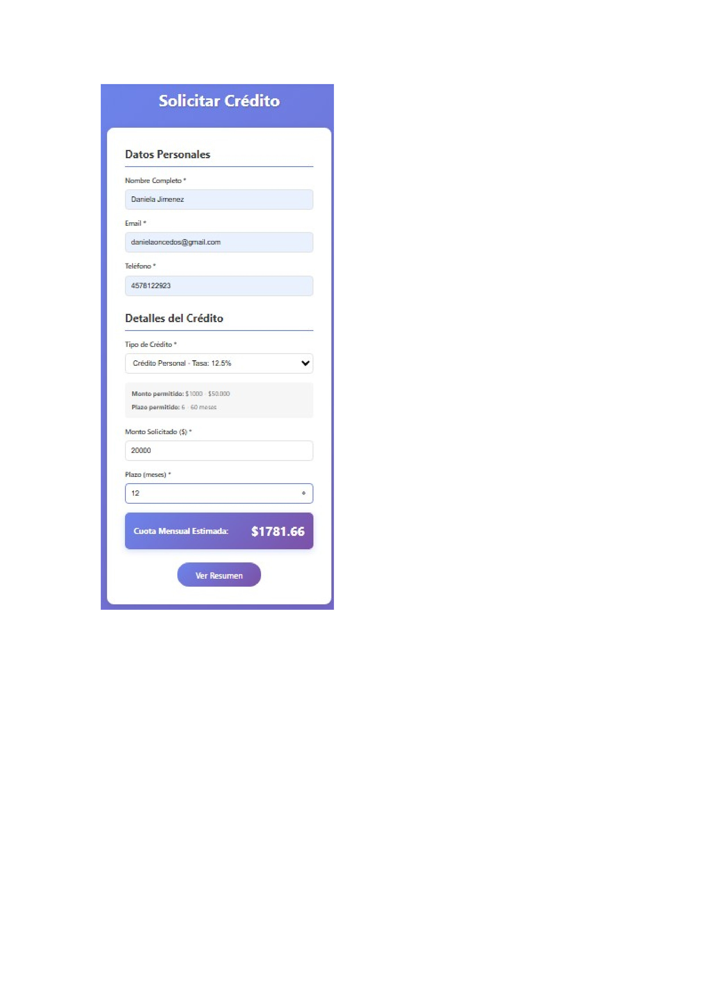

# React + Vite

This template provides a minimal setup to get React working in Vite with HMR and some ESLint rules.

Currently, two official plugins are available:

- [@vitejs/plugin-react](https://github.com/vitejs/vite-plugin-react/blob/main/packages/plugin-react) uses [Babel](https://babeljs.io/) (or [oxc](https://oxc.rs) when used in [rolldown-vite](https://vite.dev/guide/rolldown)) for Fast Refresh
- [@vitejs/plugin-react-swc](https://github.com/vitejs/vite-plugin-react/blob/main/packages/plugin-react-swc) uses [SWC](https://swc.rs/) for Fast Refresh

## React Compiler

The React Compiler is not enabled on this template because of its impact on dev & build performances. To add it, see [this documentation](https://react.dev/learn/react-compiler/installation).

## Expanding the ESLint configuration

If you are developing a production application, we recommend using TypeScript with type-aware lint rules enabled. Check out the [TS template](https://github.com/vitejs/vite/tree/main/packages/create-vite/template-react-ts) for information on how to integrate TypeScript and [`typescript-eslint`](https://typescript-eslint.io) in your project.

#  CreditSmart - Aplicación Web de Gestión de Créditos

##  Información del Estudiante
**Nombre:** Daniela Jimenez  
**Curso:** Ingeniería Web I  
**Actividad:**  Desarrollo de Aplicación Web Dinámica con React

---

##  Descripción del Proyecto

CreditSmart es una aplicación web interactiva desarrollada con React que permite a los usuarios explorar diferentes productos crediticios, simular créditos con filtros en tiempo real y solicitar créditos mediante formularios validados.

###  Características Principales

- **Página de Inicio**: Catálogo dinámico de productos crediticios con componentes reutilizables
- **Simulador**: Sistema de búsqueda y filtrado en tiempo real con múltiples criterios
- **Formulario de Solicitud**: Captura de datos con validaciones en tiempo real y cálculo automático de cuota mensual
- **Diseño Responsive**: Interfaz adaptable a diferentes dispositivos
- **Navegación Fluida**: Implementación de React Router para navegación SPA

---

##  Tecnologías Utilizadas

- **React 18** - Biblioteca principal
- **Vite** - Herramienta de construcción y desarrollo
- **React Router DOM** - Enrutamiento de la aplicación
- **CSS3** - Estilos y diseño responsive
- **JavaScript ES6+** - Lógica de la aplicación

---

##  Instalación y Configuración

### Prerrequisitos
- Node.js (versión 16 o superior)
- npm o yarn


4. **Abrir en el navegador**
```
http://localhost:5173
```

### Comandos Disponibles

```bash
npm run dev      # Ejecutar servidor de desarrollo
npm run build    # Construir para producción
npm run preview  # Vista previa de la build
```

---

##  Estructura del Proyecto

```
creditsmart/
├── src/
│   ├── components/
│   │   ├── Navbar.jsx          # Barra de navegación
│   │   └── CreditCard.jsx      # Tarjeta de crédito reutilizable
│   ├── pages/
│   │   ├── Home.jsx            # Página principal
│   │   ├── Simulator.jsx       # Simulador con filtros
│   │   └── Application.jsx     # Formulario de solicitud
│   ├── data/
│   │   └── creditsData.js      # Datos de créditos
│   ├── styles/
│   │   ├── Navbar.css
│   │   ├── CreditCard.css
│   │   ├── Home.css
│   │   ├── Simulator.css
│   │   └── Application.css
│   ├── App.jsx                 # Componente principal
│   ├── App.css                 # Estilos globales
│   └── main.jsx                # Punto de entrada
├── package.json
├── .gitignore
└── README.md
```

---

##  Funcionalidades Implementadas

### 1. Inicio - Lista Dinámica de Créditos
-  Array de objetos con productos crediticios
-  Componente CreditCard.jsx reutilizable
-  Renderizado con .map()
-  Paso de datos mediante props

### 2. Simulador - Búsqueda y Filtros
-  Búsqueda por nombre en tiempo real
-  Filtro por rango de monto (select)
-  Ordenamiento por tasa de interés
-  Mensaje cuando no hay resultados
-  Botón para limpiar filtros

### 3. Solicitar Crédito - Formulario Funcional
-  Captura de datos con useState
-  Validaciones en tiempo real:
- Nombre (mínimo 3 caracteres)
- Email (formato válido)
- Teléfono (10 dígitos)
- Montos y plazos según tipo de crédito
-  Cálculo automático de cuota mensual
-  Modal con resumen antes de enviar
-  Almacenamiento en array (memoria)
-  Mensaje de éxito
-  Limpieza automática del formulario

---

##  Capturas de Pantalla

### Página de Inicio


### Simulador con Filtros


### Formulario de Solicitud


---


### Manipulación de Arrays
- `.map()` - Renderizado de listas
- `.filter()` - Filtrado de datos
- `.sort()` - Ordenamiento de resultados
- `.find()` - Búsqueda de elementos específicos

### Validaciones Implementadas
- Validación en tiempo real de campos
- Validación de rangos según tipo de crédito
- Formato de email y teléfono
- Cálculo dinámico de cuota mensual

### Fórmula de Cuota Mensual
```javascript
payment = P * [r(1+r)^n] / [(1+r)^n - 1]
// P = Principal (monto)
// r = Tasa mensual (tasa anual / 12 / 100)
// n = Número de pagos (meses)
```


## 📝 Commits Realizados

1.  Configuración inicial de React con Vite
2.  Archivo de datos creditsData.js creado
3.  Componente CreditCard creado con props
4.  Búsqueda en tiempo real y filtros implementados
5.  Validaciones de formulario agregadas
6.  Cálculo de cuota mensual funcionando
7.  Estilos responsive actualizados
8.  README.md y documentación completa

---


